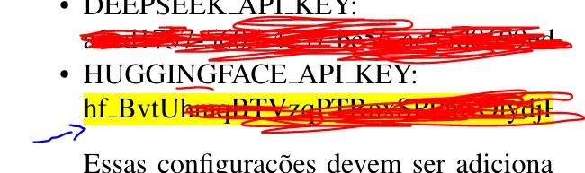

# VulnSyncAI: PLN e LLMs para Construção e Atualização Contínua de Datasets de Vulnerabilidades

[](https://opensource.org/licenses/GNU)

**Resumo do Artigo:**

_A construção e manutenção de datasets atualizados de vulnerabilidades enfrentam desafios como falta de padronização e necessidade de automação. Neste trabalho, apresentamos a VulnSyncAI, uma ferramenta modular que utiliza PLN e LLMs para correlacionar informações de múltiplas fontes, garantindo datasets atualizados e relevantes. A VulnSyncAI melhora a eficácia de modelos de IA na detecção de ameaças, automatizando processos e aumentando a eficiência na criação de datasets representativos._

---

## Estrutura do README.md

Este README.md está organizado nas seguintes seções:

1.  **Título e Resumo:** Título do projeto e um resumo conciso (cópia do resumo do artigo).
2.  **Funcionalidades:** Lista as principais funcionalidades da ferramenta.
3.  **Dependências:** Lista os requisitos de software (Python, APIs).
4.  **Preocupações com segurança:** Lista das preocupações com a segurança.
5.  **Instalação:** Instruções passo a passo para instalar a ferramenta.
6.  **Configuração:** Instruções para configurar as chaves de API.
7.  **Uso:** Descreve como reproduzir os experimentos apresentados no artigo..
8.  **Experimentos:** Explicação dos argumentos de linha de comando e exemplos de uso.
9.  **Docker (Opcional):** Instruções para construir e executar a ferramenta usando Docker.
10. **Estrutura do Código:** Breve visão geral da organização do código-fonte.
11. **Extensibilidade**: Como adicionar novas fontes e novos exportadores.
12. **Licença:** Informações sobre a licença do projeto.

---

## Funcionalidades

- **Coleta de Dados:** Busca dados de vulnerabilidades em múltiplas fontes:
  - NVD (National Vulnerability Database)
  - Vulners
  - GitHub (através de uma API, _implementação futura_)
- **Processamento de Dados:**
  - Normalização e limpeza dos dados.
  - Remoção de duplicatas.
  - Truncamento de descrições longas.
  - Filtragem de vulnerabilidades por critérios (e.g., fornecedor).
- **Extração de Informações:** Extrai informações relevantes das descrições das vulnerabilidades, como:
  - ID da vulnerabilidade (CVE, etc.)
  - Título
  - Descrição
  - Fornecedor
  - Data de publicação
  - Score CVSS (se disponível)
  - Severidade (se disponível)
  - Fonte da informação
- **Categorização com IA:**
  - Utiliza modelos de linguagem (LLMs) para categorizar as vulnerabilidades:
    - Google Gemini
    - OpenAI ChatGPT
    - Meta Llama 3
  - Extrai as seguintes informações usando os LLMs:
    - Categoria CWE (Common Weakness Enumeration)
    - Explicação da CWE
    - Fornecedor
    - Causa da vulnerabilidade
    - Impacto da vulnerabilidade
- **Exportação de Dados:**
  - Exporta os dados processados e categorizados para arquivos CSV ou JSON.
- **Extensibilidade:**
  - Arquitetura modular que facilita a adição de novas fontes de dados e novos modelos de IA.
- **Linha de Comando:**
  - Interface de linha de comando para facilitar o uso da ferramenta.

## Dependências

- Python 3.8 ou superior.
- Chaves de API para os seguintes serviços (opcional, dependendo dos módulos e LLMs que você for usar):
  - **Vulners:** Obtenha uma chave em [https://vulners.com/](https://vulners.com/)
  - **HugginFace:** Obtenha uma chave em [https://huggingface.co](https://huggingface.co/)
  - **Google Gemini:** Obtenha uma chave em [https://ai.google.dev/](https://ai.google.dev/)
  - **OpenAI ChatGPT:** Obtenha uma chave em [https://platform.openai.com/](https://platform.openai.com/)
  - **Llama (Meta):** Obtenha uma chave em [https://llama-api.com/](https://llama-api.com/)

## Preocupações com segurança

Ao executar este artefato, considere os seguintes pontos:

- **Chaves de API:** Não exponha suas chaves de API. Armazene-as de forma segura no arquivo `src/config.yaml` (conforme instruído) e **não versione este arquivo com suas chaves em repositórios públicos**. O arquivo `.gitignore` já está configurado para ignorar `config.yaml` por padrão.
- **Recursos Externos:** A ferramenta interage com APIs externas. Esteja ciente das políticas de privacidade e uso de dados de cada serviço (NVD, Vulners, Google AI, DeepSeek, HuggingFace, OpenAI).
- **Execução de Código:** Scripts automatizados podem consumir recursos (CPU, memória, rede). Erros no código ou configurações inadequadas podem levar a consumo excessivo.
- **Ambiente Isolado:** É **altamente recomendável** executar a ferramenta em um ambiente isolado, como um ambiente virtual Python (venv) ou um contêiner Docker, para evitar conflitos de dependência e potenciais problemas de segurança.

## Instalação

1.  **Clone o repositório:**

    ```bash
    git clone https://github.com/douglasfideles/VulnSyncAI.git
    cd VulnSyncAI
    ```

2.  **Crie um ambiente virtual (recomendado):**

    ```bash
    python3 -m venv .venv
    source .venv/bin/activate  # Linux/macOS
    .venv\Scripts\activate  # Windows
    ```

3.  **Instale as dependências:**

    ```bash
    pip install -r requirements.txt
    ```

    Caso tenha problemas, instale individualmente:

    ```bash
      pip install requests
      pip install transformers
      pip install asyncio
      pip install psutil
      pip install huggingface_hub
    ```

## Configuração

Você pode configurar o VulnSyncAI usando _variáveis de ambiente_ ou _argumentos de linha de comando_. A ordem de prioridade é: argumentos de linha de comando > variáveis de ambiente.

1.  **Arquivo de configuração (opcional):**
    _Não implementado no código fornecido._ Se você quisesse adicionar um arquivo de configuração (e.g., `config.ini` ou `config.yaml`), precisaria modificar o código (`main.py`) para ler as configurações desse arquivo.

## Uso

### Argumentos de Linha de Comando

```bash
python src/main.py --provider <ai_provider> --data-source <data_source> --export-format <format> --output-file <filename>  --search-params <params> --search-file <file_path>
```

- `--provider`: **Obrigatório.** Seleciona o provedor de IA para categorização. Opções:
  - `google`: Usa o Google Gemini.
  - `chatgpt`: Usa o OpenAI ChatGPT.
  - `llama`: Usa o Meta Llama.
  - `....`: Como a ferramenta é extensível é possível adicionar vários modelos de IA.
  - `none`: _Não_ usa IA para categorização (útil para coletar e normalizar dados sem categorizar).
- `--data-source`: **Obrigatório.** Seleciona a fonte de dados de vulnerabilidades. Opções:
  - `nvd`: Usa o National Vulnerability Database (NVD).
  - `vulners`: Usa a API do Vulners.
  - `....`: Como a ferramenta é extensível é possível adicionar vários fontes de dados.
  - `both`: Usa _ambas_ as fontes (NVD e Vulners).
- `--export-format`: Formato de exportação dos dados. Opções:
  - `csv`: Arquivo CSV (Comma-Separated Values).
  - `json`: Arquivo JSON.
  - O padrão é `csv`.
- `--output-file`: Nome do arquivo de saída (e caminho, se necessário). O padrão é `dataset/dds_vulnerabilities_AI.csv`.
- `--search-params`: Parâmetros de busca para vulnerabilidades (palavras-chave separadas por espaço). _Exemplo:_ `"OpenDDS" "RTI Connext DDS"`
- `--search-file`: Caminho para um arquivo _de texto_ contendo os parâmetros de busca (uma palavra-chave ou frase por linha). _Exemplo:_ `search_params.txt`

### Exemplos de Comando

1.  **Usando Google Gemini 1.5 Pro para categorização, com a fonte de dados NVD e múltiplos termos de busca:**

    ```bash
    python src/main.py --provider 'google' --data-source 'nvd' --search-params "OpenDDS" "RTI Connext DDS" --export-format csv --output-file vulnerabilidades.csv
    ```

    - `--provider`: Usa Gemini, ChatGPT, Llama ou outros.
    - `--data-source both`: Usa NVD e Vulners.
    - `--search-params`: Busca por vulnerabilidades relacionadas a "OpenDDS" _e_ "RTI Connext DDS".
    - As chaves de API são fornecidas.
    - O resultado é salvo em `vulnerabilidades.csv`.

2.  **Sem IA, usando apenas o NVD:**

    ```bash
    python src/main.py --provider 'none' --data-source 'nvd' --search-params "OpenDDS" --export-format csv --output-file vulnerabilidades_nvd.csv
    ```

3.  **Usando Gemini, Vulners e um arquivo com termos de busca:**

    Crie um arquivo `search_terms.txt` com o seguinte conteúdo (um termo por linha):

    ```
    OpenDDS
    RTI Connext DDS
    Eclipse Cyclone DDS
    ```

    Execute:

    ```bash
    python src/main.py --provider 'gemini' --data-source 'vulners' --search-file search_terms.txt --output-file vulnerabilidades_gemini.csv
    ```

## Experimentos

Esta seção descreve como reproduzir os experimentos apresentados no artigo.

**Configurações de credenciais**

Para iniciar a reprodução dos experimentos apresentados no trabalho "VulnSyncAI: PLN e LLMs para Construção e Atualização Contínua de Datasets de Vulnerabilidades" são necessárias as seguintes credenciais que estão no arquivo do "Apêndice" separado:

- VULNERS_API_KEY
- GEMINI_API_KEY
- DEEPSEEK_API_KEY
- HUGGINGFACE_API_KEY

Essas credenciais devem ser alteradas no arquivo de configuração, `VulnSyncAI\src\config.yaml`

**⚠️ Atenção ao Copiar Chaves de API:**

Ao copiar e colar as chaves de API (por exemplo, do Apêndice do artigo ou de outras fontes), verifique **cuidadosamente** se a chave foi copiada integralmente. É comum que caracteres especiais, como o **underscore (`_`)**, sejam omitidos ou perdidos durante o processo de cópia, especialmente de arquivos PDF.

**Certifique-se de que a chave colada no arquivo de configuração (`config.yaml` ou variáveis de ambiente) seja idêntica à chave original, incluindo todos os underscores.** Chaves incorretas ou incompletas resultarão em falhas de autenticação com os serviços correspondentes.



**Pré-requisitos:**

1.  Instalação completa e ambiente virtual ativado.
2.  Arquivo `src/config.yaml` criado e preenchido com as chaves de API **corretas** (Vulners, Gemini, DeepSeek, HuggingFace). **Verifique os underscores!**
3.  Os arquivos com termos de busca estão disponíveis no diretório `search_files/`.

**Execução por Reivindicação (Claim):**

_(Nota: Os nomes dos arquivos de saída gerados podem variar ligeiramente dependendo da implementação exata do script. Os nomes abaixo são exemplos baseados no apêndice. Adapte conforme necessário.)_

**Reivindicação #1: Coleta e Categorização de Vulnerabilidades em DDS**

- **Objetivo:** Coletar dados de DDS, categorizar com Gemini e Llama3.
- **Comandos:**
  - **Gemini (NVD):**
    ```bash
    python src/main.py --provider 'google' --data-source 'nvd' --search-file search_files/search_params_DDS.txt --export-format csv --output-file google_dataset/DDS_vulnerabilities_categorized-NVD-GEMINI-API.csv
    ```
  - **Llama3 (NVD):**
    ```bash
    python src/main.py --provider 'llama3' --data-source 'nvd' --search-file search_files/search_params_DDS.txt --export-format csv --output-file llama3_dataset/DDS_vulnerabilities_categorized-NVD-LLAMA3-LOCAL.csv
    ```
- **Verificação:** Verifique se os arquivos CSV foram criados nos diretórios `google_dataset/` e `llama3_dataset/`. Abra os arquivos e inspecione as colunas (ID, descrição, colunas de categorização como CWE, etc.). Compare os resultados gerais (tipos de CWEs, fornecedores) com as tabelas/gráficos do artigo, lembrando da natureza estocástica dos LLMs.

**Reivindicação #2: Análise de Protocolos de Roteamento em UAVs**

- **Objetivo:** Coletar dados de protocolos de roteamento UAV, categorizar com Gemini e Llama3.
- **Comandos:**
  - **Gemini (NVD):**
    ```bash
    python src/main.py --provider 'google' --data-source 'nvd' --search-file search_files/search_params_UAV.txt --export-format csv --output-file google_dataset/UAV_vulnerabilities_categorized-GEMINI-API.csv
    ```
  - **Llama3 (NVD):**
    ```bash
    python src/main.py --provider 'llama3' --data-source 'nvd' --search-file search_files/search_params_UAV.txt --export-format csv --output-file llama3_dataset/UAV_vulnerabilities_categorized-NVD-LLAMA3-LOCAL.csv
    ```
- **Verificação:** Similar à Reivindicação #1, verificando os arquivos CSV nos diretórios correspondentes.

**Reivindicação #3: Estudo de Caso MQTT**

- **Objetivo:** Coletar dados de MQTT (NVD e Vulners), categorizar com Gemini, Llama3 e DeepSeek.
- **Comandos:**
  - **Gemini (NVD):**
    ```bash
    python src/main.py --provider 'google' --data-source 'nvd' --search-file search_files/search_params_MQTT.txt --export-format csv --output-file google_dataset/MQTT_vulnerabilities_categorized-NVD-GEMINI-API.csv
    ```
  - **Gemini (Vulners):**
    ```bash
    python src/main.py --provider 'google' --data-source 'vulners' --search-file search_files/search_params_MQTT.txt --export-format csv --output-file google_dataset/MQTT_vulnerabilities_categorized-VULNERS-GEMINI-API.csv
    ```
  - **Llama3 (NVD):**
    ```bash
    python src/main.py --provider 'llama3' --data-source 'nvd' --search-file search_files/search_params_MQTT.txt --export-format csv --output-file llama3_dataset/MQTT_vulnerabilities_categorized-NVD-LLAMA3-LOCAL.csv
    ```
  - **Llama3 (Vulners):**
    ```bash
    python src/main.py --provider 'llama3' --data-source 'vulners' --search-file search_files/search_params_MQTT.txt --export-format csv --output-file llama3_dataset/MQTT_vulnerabilities_categorized-VULNERS-LLAMA3-LOCAL.csv
    ```
  - **DeepSeek (NVD):**
    ```bash
    python src/main.py --provider 'deepseek' --data-source 'nvd' --search-file search_files/search_params_MQTT.txt --export-format csv --output-file deepseek_dataset/MQTT_vulnerabilities_categorized-NVD-DEEPSEEK.csv
    ```
  - **DeepSeek (Vulners):**
    ```bash
    python src/main.py --provider 'deepseek' --data-source 'vulners' --search-file search_files/search_params_MQTT.txt --export-format csv --output-file deepseek_dataset/MQTT_vulnerabilities_categorized-VULNERS-DEEPSEEK.csv
    ```
- **Verificação:** Similar às anteriores, verificando os múltiplos arquivos gerados.

**Reivindicação #4: Estudo de Caso Navegadores Web**

- **Objetivo:** Coletar dados de Navegadores Web (NVD), categorizar com Gemini e Llama3.
- **Comandos:**
  - **Gemini (NVD):**
    ```bash
    python src/main.py --provider 'google' --data-source 'nvd' --search-file search_files/search_params_BROWSERS.txt --export-format csv --output-file google_dataset/BROWSERS_vulnerabilities_categorized-NVD-GEMINI-API.csv
    ```
  - **Llama3 (NVD):**
    ```bash
    python src/main.py --provider 'llama3' --data-source 'nvd' --search-file search_files/search_params_BROWSERS.txt --export-format csv --output-file llama3_dataset/BROWSERS_vulnerabilities_categorized-NVD-LLAMA3-LOCAL.csv
    ```
- **Verificação:** Similar às anteriores.

**Geração da análise dos resultados**

Para reproduzir os dados apresentados no trabalho com base nos datasets gerados é disponbilizado uma ferramenta que recebe o arquivo do dataset gerado em formato CSV e retorna gráficos e dados conforme o dataset.

- **Estrutura de Arquivos**: O script `analysis.py` deve estar localizado no mesmo diretório onde os datasets estão armazenados ou no diretório raiz do projeto.

Após gerar os datasets eles vão estár disponíveis para a geração dos resultados:

BROWSERS Vulnerabilities:

- BROWSERS_vulnerabilities_categorized-NVD-LLAMA3-LOCAL.csv
- BROWSERS_vulnerabilities_categorized-NVD-GEMINI-API.csv

MQTT Vulnerabilities:

- MQTT_vulnerabilities_categorized-NVD-LLAMA3-LOCAL.csv
- MQTT_vulnerabilities_categorized-NVD-GEMINI-API.csv
- MQTT_vulnerabilities_categorized-VULNERS-LLAMA3-LOCAL.csv
- MQTT_vulnerabilities_categorized-VULNERS-GEMINI.csv
- MQTT_vulnerabilities_categorized-VULNERS-DEEPSEEK.csv
- MQTT_vulnerabilities_categorized-NVD-DEEPSEEK.csv

DDS Vulnerabilities:

- DDS_vulnerabilities_categorized-NVD-LLAMA3-LOCAL.csv
- DDS_vulnerabilities_categorized-NVD-GEMINI-API.csv

UAV Vulnerabilities:

- UAV_vulnerabilities_categorized-NVD-LLAMA3-LOCAL.csv
- UAV_vulnerabilities_categorized-GEMINI-API.csv

**Como Executar a Análise**

Passo 1: Preparar o Ambiente

- Certifique-se de que todos os arquivos CSV estão no mesmo diretório ou forneça o caminho completo para cada arquivo.

Passo 2: Executar o Script

Use o seguinte comando para executar o script para os datasets gerados:

**Datasets DDS**

```bash
python analysis.py google_dataset/DDS_vulnerabilities_categorized-NVD-GEMINI-API.csv llama3_dataset/DDS_vulnerabilities_categorized-NVD-LLAMA3-LOCAL.csv
```

**Datasets UAV**

```bash
python analysis.py google_dataset/UAV_vulnerabilities_categorized-GEMINI-API.csv llama3_dataset/UAV_vulnerabilities_categorized-NVD-LLAMA3-LOCAL.csv
```

**Datasets MQTT**

```bash
python analysis.py google_dataset/MQTT_vulnerabilities_categorized-NVD-GEMINI-API.csv google_dataset/MQTT_vulnerabilities_categorized-VULNERS-GEMINI-API.csv
```

```bash
python analysis.py llama3_dataset/MQTT_vulnerabilities_categorized-NVD-LLAMA3-LOCAL.csv llama3_dataset/MQTT_vulnerabilities_categorized-VULNERS-LLAMA3-LOCAL.csv
```

```bash
python analysis.py deekseek_dataset/MQTT_vulnerabilities_categorized-NVD-DEEPSEEK.csv deekseek_dataset/MQTT_vulnerabilities_categorized-VULNERS-DEEPSEEK.csv
```

**Resultados**

- Os resultados serão salvos na pasta analysis_results, organizada por dataset. Para cada dataset, os seguintes arquivos serão gerados:
  - Log de Análise: <nome_do_dataset>\_analysis.txt
  - Gráficos:
    - vulnerabilities_by_vendor.png: Gráfico de barras mostrando a distribuição de vulnerabilidades por fornecedor.
    - vulnerabilities_by_year.png: Gráfico de linha mostrando a distribuição de vulnerabilidades por ano.
    - cvss_distribution.png: Histograma mostrando a distribuição dos scores CVSS.
    - top_5_cwe.png: Gráfico de pizza mostrando as 5 categorias CWE mais frequentes.
  - Descrição dos Logs:
    - Total de Vulnerabilidades: Número total de vulnerabilidades no dataset.
    - Distribuição por Fornecedor: Quantidade de vulnerabilidades por fornecedor.
    - Distribuição por Ano: Quantidade de vulnerabilidades por ano.
    - Estatísticas de CVSS Scores: Estatísticas descritivas (média, mediana, etc.) dos scores CVSS.
    - Top 5 Categorias CWE: As 5 categorias CWE mais frequentes.
    - Correlação entre Severidade e Fornecedor: - Tabela de contingência mostrando a relação entre severidade e fornecedor.

**Observações Gerais (para todos os estudos de caso):**

- **Reprodutibilidade:** Os resultados _exatos_ podem variar um pouco devido a:
  - **Atualizações nas bases de dados:** O NVD e o Vulners são constantemente atualizados. Novas vulnerabilidades podem ser adicionadas, e as informações sobre vulnerabilidades existentes podem ser modificadas.
  - **Estocasticidade dos LLMs:** Os LLMs (Gemini, Llama, DeepSeek ou outros) não são completamente determinísticos\*. Pequenas variações nas respostas são esperadas, mesmo com o mesmo prompt e os mesmos dados de entrada.
- **Tempo de Execução:** A coleta de dados, especialmente do Vulners, e a categorização com os LLMs _podem levar um tempo considerável_ (dependendo do número de termos de busca, da quantidade de vulnerabilidades encontradas e da velocidade da sua conexão com a internet e das APIs). Principalmente para rodar modelos locais, como Llama3 (DeepHermes-3-Llama-3-8B-Preview3)
- **Erros/Exceções:**
- O código fornecido tem _algum_ tratamento de erros (e.g., `try...except` para chamadas de API), mas _não é exaustivo_. É _possível_ que ocorram erros durante a execução (e.g., problemas de conexão, limites de taxa de API, etc.).
- Se ocorrerem erros, _leia atentamente as mensagens de erro_. Elas podem fornecer pistas sobre o problema.
- Verifique se as _chaves de API_ estão corretas e se você _não atingiu os limites de uso_ das APIs.
- Verifique sua conexão com a internet\_.
- **Dados de Saída:**
  - Os arquivos CSV gerados terão as colunas especificadas no código (`id`, `description`, `vendor`, `cwe_category`, etc.).
  - Os valores para `cwe_category`, `explanation`, `cause` e `impact` serão preenchidos pelos LLMs (ou "UNKNOWN" se a categorização falhar).
  - Os valores para `published`, `cvss_score`, `severity` e `source` virão das fontes de dados (NVD ou Vulners).

## Docker

Você também pode construir e executar a ferramenta usando Docker, o que encapsula o ambiente e as dependências.

### Dockerfile

```dockerfile
# Use uma imagem oficial do Python como imagem base
FROM python:3.10-slim

# Defina o diretório de trabalho no contêiner
WORKDIR /app

# Copie o conteúdo do diretório atual para o contêiner em /app
COPY . /app

# Instale os pacotes necessários especificados em requirements.txt
RUN pip install --no-cache-dir -r requirements.txt

# Defina a variável de ambiente
ENV NAME VulnSyncAI

# Execute main.py quando o contêiner for iniciado
CMD ["python", "src/main.py"]
```

### Construir e Executar o Contêiner Docker

1.  **Construir a imagem:**

    ```bash
    docker build -t vulnsyncai .
    ```

2.  **Executar o container usando IA para categorização:**
    _(Este exemplo assume que o modelo Llama3 e a configuração estão dentro da imagem ou acessíveis. Para modelos locais grandes ou para usar um `config.yaml` externo, pode ser necessário montar volumes (`-v`).)_
    `bash
    docker run vulnsyncai python src/main.py --provider 'llama3' --data-source 'nvd' --export-format csv --output-file vulnerabilidades.csv --search-params "OpenDDS" "RTI Connext DDS"
    `

3.  **Executar o container sem usar IA para categorização:**

    ```bash
    docker run --provider 'none' --data-source nvd --export-format csv --output-file vulnerabilidades.csv --search-params "OpenDDS"
    ```

## Estrutura do Código

O código-fonte está organizado da seguinte forma:

## Estrutura do Código

```
VulnSyncAI/
├── .gitignore                # Arquivos/pastas a serem ignorados pelo Git
├── Dockerfile                # Instruções para construir a imagem Docker
├── LICENSE                   # Arquivo de licença (GPL-3.0)
├── README.md                 # Este arquivo
├── analysis.py               # Script para gerar análises e gráficos dos datasets
├── requirements.txt          # Dependências Python
├── search_files/             # Arquivos de texto com termos de busca para os experimentos
│   ├── search_params_BROWSERS.txt
│   ├── search_params_DDS.txt
│   ├── search_params_MQTT.txt
│   └── search_params_UAV.txt
├── src/                      # Diretório principal do código fonte
│   ├── __init__.py
│   ├── config.yaml.example   # Arquivo de exemplo para configuração
│   # │── config.yaml         # SEU ARQUIVO DE CONFIGURAÇÃO (NÃO VERSIONAR COM CHAVES!)
│   ├── main.py               # Ponto de entrada principal do script CLI
│   ├── categorization/       # Módulos para categorização com IA/LLMs
│   │   ├── __init__.py
│   │   └── categorizer.py    # Classe principal de categorização
│   ├── data_sources/         # Módulos para extrair dados de diferentes fontes
│   │   ├── __init__.py
│   │   ├── data_source.py    # Classe base para fontes de dados
│   │   ├── nvd_extractor.py  # Extrator para NVD
│   │   └── vulners_extractor.py # Extrator para Vulners API
│   │   # └── github_extractor.py # (Implementação futura)
│   ├── output/               # Módulos para exportar dados em diferentes formatos
│   │   ├── __init__.py
│   │   ├── data_exporter.py  # Classe base para exportadores
│   │   ├── csv_exporter.py   # Exportador para CSV
│   │   └── json_exporter.py  # Exportador para JSON
│   └── processing/           # Módulos para processamento e normalização de dados
│       ├── __init__.py
│       ├── data_preprocessor.py # Orquestrador do pré-processamento
│       ├── filter.py         # Funções de filtragem
│       ├── load_data_source.py # Carrega dados das fontes
│       └── normalizer.py     # Funções de normalização
├── google_dataset/           # Diretório para datasets gerados com Gemini (exemplo)
├── llama3_dataset/           # Diretório para datasets gerados com Llama3 (exemplo)
├── deepseek_dataset/         # Diretório para datasets gerados com DeepSeek (exemplo)
└── analysis_results/         # Diretório onde os resultados da análise são salvos
```

## Extensibilidade

O VulnSyncAI foi projetado para ser extensível, permitindo a adição de novas fontes de dados, normalizadores e formatos de saída de forma simples e organizada. A arquitetura modular da ferramenta facilita a integração de novos componentes sem a necessidade de modificar o código principal. A seguir, descrevemos como adicionar novas fontes de dados e novos formatos de saída.

### Adicionando Novas Fontes de Dados

Para adicionar uma nova fonte de dados, siga os seguintes passos:

1.  **Crie um Novo Módulo Extractor:**

    - Dentro do diretório `data_sources/`, crie um novo arquivo Python com um nome descritivo para a nova fonte de dados, seguindo o padrão `nova_fonte_extractor.py`. Por exemplo, se você deseja adicionar uma fonte chamada "MySource", crie o arquivo `data_sources/mysource_extractor.py`.

2.  **Implemente a Classe Extractor:**

    - Dentro do novo arquivo (e.g., `mysource_extractor.py`), crie uma classe que herde da classe base `DataSourceBase` (definida em `data_sources/data_source.py`). Isso garante que a nova fonte de dados siga a interface esperada pela ferramenta.
    - Implemente o método `collect_data(self, search_params)`:

      - Este método é responsável por _coletar_ os dados da nova fonte.
      - Ele recebe uma lista de `search_params` (termos de busca).
      - Ele deve _retornar_ uma lista de _dicionários_, onde cada dicionário representa uma vulnerabilidade (ainda em um formato _bruto_, sem normalização). _Não se preocupe com o formato dos dados neste ponto; a normalização será feita posteriormente._
      - Use a biblioteca `requests` para fazer as requisições HTTP, se necessário. _Lembre-se de tratar erros e exceções (conexão, rate limits, etc.) de forma adequada._
      - Se a nova fonte de dados tiver sua própria API, use essa API. Se for uma página web, você pode usar bibliotecas como `BeautifulSoup` para fazer o parsing do HTML.
      - Exemplo:

        ```python
        # data_sources/mysource_extractor.py
        import requests
        from .data_source import DataSourceBase

        class MySourceExtractor(DataSourceBase):
            async def collect_data(self, search_params):
                vulnerabilities = []
                for param in search_params:
                    try:
                        # Exemplo de chamada de API (substitua pela lógica real)
                        response = requests.get(f"https://api.mysource.com/vulnerabilities?q={param}")
                        response.raise_for_status()  # Lança exceção se erro HTTP
                        data = response.json()
                        # Adapte a lógica de extração para o formato da sua fonte
                        vulnerabilities.extend(data.get('vulnerabilities', [])) #Adiciona no fim
                    except requests.exceptions.RequestException as e:
                        print(f"Erro ao coletar dados da MySource para '{param}': {e}")
                return vulnerabilities

            def normalize_data(self, vulnerability):
              #Esta função é criada na etapa 5.
        ```

3.  **Atualize o Arquivo de Configuração:**

    - Adicione a nova fonte de dados ao arquivo `config.yaml`:

    ```yaml
    data_sources:
      - nvd
      - vulners
      - mysource

      normalizers:
      - basic

      exporters:
      - csv
      - json
    ```

### Adicionando Novos Formatos de Saída

Para adicionar um novo formato de saída, siga os seguintes passos:

1.  **Crie um Novo Módulo Exporter:**

    - Dentro do diretório output/, crie um novo arquivo Python com um nome descritivo para o novo formato de saída, seguindo o padrão novo_formato_exporter.py. Por exemplo, se você deseja adicionar um formato chamado "XML", crie o arquivo `output/xml_exporter.py`. Por exemplo, se você deseja adicionar um formato chamado "XML", crie o arquivo `output/xml_exporter.py`.

2.  **Implemente a Classe Exporter:**

    - Dentro do novo arquivo `(e.g., xml_exporter.py)`, crie uma classe que herde da classe base `DataExporterBase` (definida em `output/data_exporter.py`). Isso garante que o novo formato de saída siga a interface esperada pela ferramenta.
    - Implemente o método `export(self, data, filename)`:

      - Este método é responsável por exportar os dados no novo formato.
      - Ele recebe os dados a serem exportados e o nome do arquivo de saída.
      - Exemplo:

        ```python

        # output/xml_exporter.py

        import xml.etree.ElementTree as ET
        from .data_exporter import DataExporterBase

        class XmlExporter(DataExporterBase):
          def export(self, data, filename):
             root = ET.Element("Vulnerabilities")
            for item in data:
              vuln_elem = ET.SubElement(root, "Vulnerability")
               for key, value in item.items():
                child = ET.SubElement(vuln_elem, key)
                child.text = str(value)
            tree = ET.ElementTree(root)
          tree.write(filename, encoding='utf-8', xml_declaration=True
        ```

3.  **Atualize o Arquivo de Configuração:**

    - Adicione o novo formato de saída ao arquivo `config.yaml`:

    ```yaml
    data_sources:
      - nvd
      - vulners
      - mysource

      normalizers:
      - basic

      exporters:
      - csv
      - json
      - xml
    ```

### Adicionar Novo Modelo de Dados

Passos para Adicionar um Novo Modelo de Dados

1.  **Registrar o Modelo:**

    - Adicione o novo modelo ao arquivo config.yaml na seção models_to_evaluate:

    ```yaml
      models_to_evaluate:
    - model: "novo-modelo"
      type: "local"
      provider: "novo_provedor"
      config: "configurações_do_modelo"
    ```

2.  **Utilizar o Modelo:**

- Adicione o novo modelo ao arquivo config.yaml na seção models_to_evaluate:

  ```bash
  python src/main.py --provider 'novo_provedor' --data-source 'nvd' --export-format csv --output-file vulnerabilidades.csv --search-params "OpenDDS" "RTI Connext DDS"
  ```

## Observações Gerais e Solução de Problemas

- **Reprodutibilidade:** Os resultados exatos da categorização por LLMs podem variar ligeiramente entre execuções devido à natureza estocástica desses modelos. Além disso, as bases de dados (NVD, Vulners) são atualizadas constantemente, então executar o script em momentos diferentes pode resultar em conjuntos de dados ligeiramente diferentes.
- **Tempo de Execução:** A coleta de dados (especialmente do Vulners) e a categorização com LLMs (especialmente modelos locais ou APIs com limites de taxa) podem levar um tempo considerável, dependendo da quantidade de dados e da velocidade da rede/API.
- **Limites de Taxa (Rate Limits):** As APIs externas (Vulners, Gemini, DeepSeek, etc.) geralmente possuem limites de taxa. O código pode ter algum tratamento básico, mas execuções intensivas podem atingir esses limites, resultando em erros. Espere um pouco e tente novamente, ou ajuste os parâmetros de busca para reduzir o número de requisições.
- **Erros Comuns:**
  - **Erro de Autenticação:** Quase sempre causado por uma chave de API incorreta ou faltando no `config.yaml`. **VERIFIQUE OS UNDERSCORES (`_`)!**
  - **Erro de Conexão:** Verifique sua conexão com a internet.
  - **Modelo Não Encontrado (Llama3 local):** Certifique-se de que o modelo especificado em `config.yaml` (`models_config.llama3.model_name`) está correto e que você tem os recursos (RAM, VRAM, espaço em disco) e as bibliotecas (`transformers`, `torch`, etc.) corretamente instalados para executá-lo. Pode ser necessário login na HuggingFace CLI (`huggingface-cli login`).
  - **Dependências Faltando:** Certifique-se de ter instalado tudo do `requirements.txt` no ambiente virtual ativo.
- **Saída "UNKNOWN":** Se as colunas de categorização (CWE, causa, etc.) mostrarem "UNKNOWN", significa que o LLM não conseguiu extrair a informação ou houve um erro durante a chamada da API para aquela vulnerabilidade específica.

## Licença

Este projeto está licenciado sob a Licença GNU - veja o arquivo [LICENSE](LICENSE) para mais detalhes.
